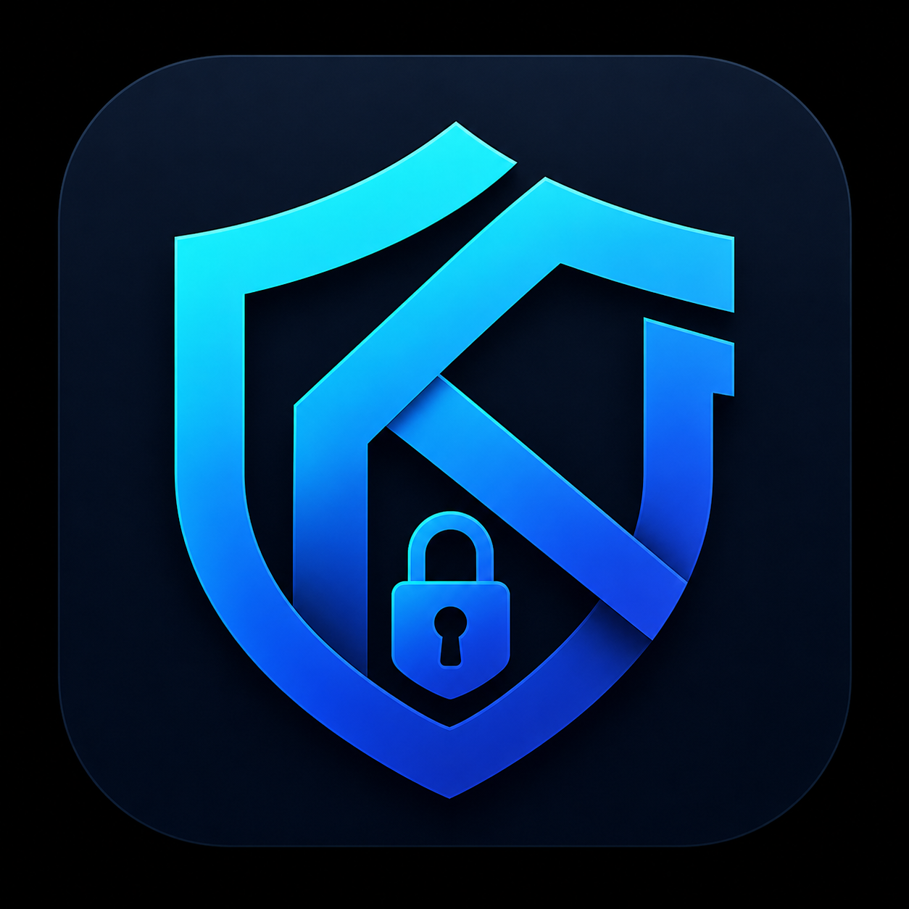

<p align="center">
  
</p>

<h1 align="center">Kutra Authenticator</h1>

<p align="center">
  <b>A privacy-first, cross-platform authentication system built for modern applications and developers.</b>
</p>

<p align="center">
  
  
  
  
  
  
</p>

---

Kutra Authenticator is not just a login system — it is a secure identity layer designed for offline-first usage, encrypted backups, and full OTPAuth compatibility. Unlike rigid alternatives, Kutra offers a **Developer Mode** with fully customizable OTP parameters.


[](https://app.fossa.com/projects/git%2Bgithub.com%2FKutraCorporation%2Fauthenticator?ref=badge_large)

## 🚀 Vision
[](https://app.fossa.com/projects/git%2Bgithub.com%2FKutraCorporation%2Fauthenticator?ref=badge_shield)


Replace fragmented authentication apps with a unified, open, and secure identity ecosystem. **Beyond Limits.**

## ⚙️ Core Features

- 🔐 **OTPAuth-compatible TOTP/HOTP generator** (RFC 6238 / RFC 4226)
- 📱 Cross-platform support (Flutter: Android, iOS, Windows, macOS, Linux)
- 🧠 Offline-first architecture (no mandatory cloud dependency)
- 🔑 Secure local encrypted storage
- 📷 QR code scanning and provisioning support
- 🔄 Import / export encrypted vault
- 🌐 Optional cloud sync (end-to-end encrypted)

## 🧩 Architecture

- **UI Layer:** Flutter (Material 3 / Cupertino)
- **Core Logic:** Dart OTPAuth Parser (Custom RFC implementation)
- **Storage:** `flutter_secure_storage` (Keychain/Keystore backed)

## 🔐 Security Model

- Secrets never leave device unencrypted
- AES-256 encrypted local storage
- Optional device-to-device encrypted sync via mDNS or cloud relay
- No tracking, no telemetry

## 📲 Supported Platforms

- 🤖 **Android** (APK / AAB)
- 🍎 **iOS** (IPA)
- 🪟 **Windows** (EXE / MSIX)
- 🍏 **macOS** (DMG)
- 🐧 **Linux** (AppImage / Flatpak)

## 🛠️ Installation

```bash
git clone https://github.com/KutraCorporation/authenticator.git
cd authenticator
flutter pub get
flutter run
```

## Contribute
We welcome your contributions!

* Fork
* Create a Feature branch (git checkout -b feature/amazing-feature)
* Commit your changes (git commit -m 'Add amazing feature')
* Push your branch (git push origin feature/amazing-feature)
* Create a Pull Request

##  License
Open-source (MIT / Apache 2.0 depending on module)

> Built with privacy, simplicity, and developer freedom in mind.<br/>Kutra Corporation — Beyond Limits.
